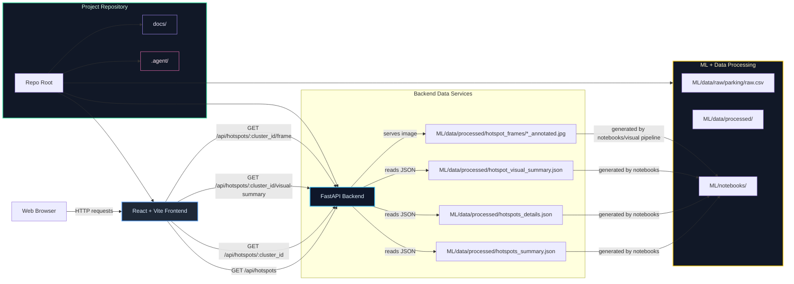

# ParkSense Architecture

This document describes the current ParkSense prototype architecture using a Mermaid diagram. It highlights the frontend, backend, and ML/data components, plus the main API and file dependencies.

## Key components

- `website/frontend/`: React + Vite app that displays the ParkSense map, hotspot dashboard, and reporting UI.
- `website/backend/`: FastAPI backend exposing `/api/hotspots`, `/api/hotspots/{cluster_id}`, `/api/hotspots/{cluster_id}/visual-summary`, and `/api/hotspots/{cluster_id}/frame`.
- `ML/data/processed/`: Processed JSON files and annotated images consumed by the backend.
- `ML/notebooks/`: Notebook source for data cleaning, clustering, hotspot scoring, and visual evidence generation.

## Current architecture notes

- The backend is file-backed and does not require a separate database; it serves processed JSON and image assets directly from `ML/data/processed/`.
- The frontend fetches hotspot data from the backend and renders an interactive map/dashboard in the browser.
- The ML pipeline produces the data artifacts that power the API and the demo.
