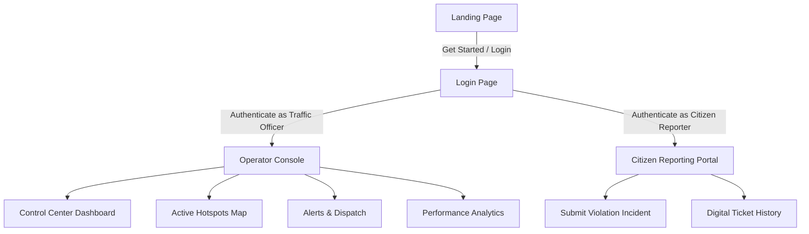

# ParkSense: Enhancements & Alignment Plan

## 1. Problem Statement Alignment: Are We Deviated?

**Yes, our application is currently deviated from the core problem statement.**

* **Current Implementation:** The app is built like a commercial **parking garage management and space booking service** (reminiscent of ParkMobile or SpotHero), complete with parking slot bookings, EV charging stations, and garage revenue forecasting.
* **Core Problem Statement:** *How can AI-driven parking intelligence detect illegal parking hotspots and quantify their impact on traffic flow to enable targeted enforcement?* (See research paper: [AI Parking Hackathon Research.pdf](file:///c:/Users/Anant/Poor-Visibility-on-Parking-Induced-Congestion/docs/AI%20Parking%20Hackathon%20Research.pdf))
* **Target Audience:** Traffic police department, city planning authorities, and municipal enforcement agents, rather than consumers booking a parking spot.

### Redefining the Application Focus
To align with the hackathon goals, we must reposition the features as follows:
* **The Dashboard & Map:** Show illegal parking hotspots, on-street violations, and their quantified impact on road capacity and delays (using EWR - Effective Width Reduction and SPI - Space Pressure Index).
* **The Booking Flow:** Repurpose this as a **Citizen Traffic Violation Reporter** (where citizens can upload geo-tagged photos of illegal double-parking, contributing to the AI heatmap) OR a **Smart Loading Bay Dispatcher** (where delivery vans register loading windows, reducing random curbside double-parking). Let's go with the **Citizen Violation Reporter** as it directly targets enforcement.
* **Rename the Application:** Shift from "AiParking" to a name that represents urban traffic enforcement. 
  * *Recommended Name:* **ParkSense** (Integrates with Bengaluru Traffic Police's existing *ParkSense* - Active Traffic Management system, making it highly context-aware and realistic for the hackathon).
  * *Alternative Name:* **ParkVigil AI** or **CurbPulse**.

---

## 2. Restructuring User Flow & Navigation

To establish a logical entry point and secure the operator's console, we will restructure the routing:



### Flow Breakdown
1. **Landing Page (Home):** A public-facing site highlighting the AI systems' capabilities. In the top-right header, a prominent **"Operator Portal"** or **"Get Started"** button will lead to the Login Page.
2. **Login Page:** A secure, themed login form. Users can select a profile to log in:
   * **Traffic Officer / Dispatcher:** Grants access to the fully dark-themed Command Center (Dashboard, Map, Alerts, Reports).
   * **Citizen Reporter:** Grants access to the mobile-simulated reporting tool (repurposed Booking view).
3. **Sidebar Visibility:** The Operator Sidebar will remain hidden on the Landing Page and Login Page, showing *only* when the user is logged into the Operator Console.

---

## 3. List of Non-Functional Elements & Functional Upgrades

Below is a list of currently static/placeholder items on the website, alongside our proposed functional enhancements:

| View / Element | Current Non-Functional State | Proposed Functional Implementation |
| :--- | :--- | :--- |
| **Search Bar (Header)** | Static input, does nothing on typing. | **Hotspot Filter:** Filter the active hotspots in the Control Center and Map by police jurisdiction (e.g. searching "Shivajinagar" or "Malleshwaram" focuses the map and filters lists). |
| **Deploy Unit Button (Sidebar)** | Triggers a generic JavaScript alert `alert('AI Unit dispatch initialized')`. | **Dispatch Control Modal:** Opens a modal that lets the operator choose a specific patrol patrol vehicle (e.g. "Challan Unit 14", "Tow Truck 3") to dispatch to the active cluster, displaying a mock routing path and ETA. |
| **Live Event Feed (Control Center)** | Static lists of vehicle entries and slot occupancies. | **Interactive Incident Tracer:** Clicking on a feed item (e.g., a double parking alert) highlights its location on the Map, opens the details drawer, and displays simulated CCTV snapshot / OCR plate details. |
| **Control Center Metrics** | Displays garage-centric metrics like "Slot Availability (842 / 1200)" and "Projected Revenue ($14.2k)". | **Enforcement-Centric Metrics:**<br>1. **Active Violations:** Count of ongoing double-parking/sidewalk blocks.<br>2. **Congestion Delay Cost:** Municipal economic losses calculated from cumulative delays.<br>3. **Challans Issued:** Counter of automated tickets generated.<br>4. **Traffic Speed Drop:** Average speed reduction percentage across hotspots. |
| **Booking Flow (Views/BookingFlow.tsx)** | Rigid consumer-style mobile phone simulator to reserve a garage slot. Navbar overlaps on small heights. | **Citizen Reporting Simulator & UI Fix:**<br>1. Fix layout overlapping by removing the rigid `aspect-[16/10]` and replacing with natural vertical padding that scales.<br>2. Repurpose steps: **Step 1:** Upload violation photo (simulated). **Step 2:** Select violation category (Double Parking, Sidewalk Block, Bus Lane Obstruction) and enter vehicle plate. **Step 3:** AI auto-extraction (OCR) mock preview and geo-tag location lock. **Step 4:** Success ticket confirmation. Submission dynamically updates the dashboard alert count! |
| **Alert Monitoring (Alerts)** | Static tables of unresolved alerts. | **Operator Action Queue:** Allow operators to select an alert, review the AI confidence rating, and click **"Approve Challan"** or **"Send Warning"** which removes it from the queue and logs it. |

---

## 4. UI Fixes: Resolving Navbar Overlap

### The Issue
The unified `Header` component uses a `fixed` positioning with height `h-20` (80px). 
In `BookingFlow.tsx`, the parent container utilizes `min-h-screen flex items-center justify-center pt-28 pb-20`. When the viewport height is low (like 695px on typical laptops), the rigid `aspect-[16/10]` card with `max-h-[640px]` overflows vertically. Because the container forces centering, the card overlaps with the fixed header, preventing the user from clicking the top navbar or seeing the top of the browser simulator.

### The Fix
1. **Remove Rigid Constraints:** Replace `aspect-[16/10]` and `max-h-[640px]` on the browser frame container in [BookingFlow.tsx](file:///c:/Users/Anant/Poor-Visibility-on-Parking-Induced-Congestion/website/frontend/src/views/BookingFlow.tsx). Let it expand dynamically according to its content height.
2. **Responsive Padding:** Adjust the top padding `pt-28` to be relative, and let the page scroll naturally if the viewport height is smaller than the browser card height.
3. **Unified Page Wrapper:** Create a consistent content wrapper class in CSS that guarantees no overlap for all pages:
   ```css
   .page-container {
     padding-top: 5rem; /* 80px matching header height */
     min-height: calc(100vh - 5rem);
   }
   ```

---

## 5. Next Steps & Implementation Tasks

1. **Phase 1: Brand & Layout Refactor**
   * Rename UI headers, titles, and logos to **ParkSense**.
   * Resolve the vertical layout overlap bug in the mobile-frame simulator.
2. **Phase 2: Authentication & Routing Flow**
   * Create a new `Login.tsx` view.
   * Modify `App.tsx` state to handle active user sessions (operator vs citizen vs anonymous).
   * Update `Header.tsx` to display a "Get Started / Log In" button.
3. **Phase 3: Repurposing & Functional Interactivity**
   * Redesign `BookingFlow.tsx` as a Citizen Reporting Flow.
   * Repurpose Control Center statistics to match urban congestion metrics.
   * Create the Dispatch Patrol Modal for the "Deploy Unit" button.
   * Implement search filtering and clickable incident feeds.
